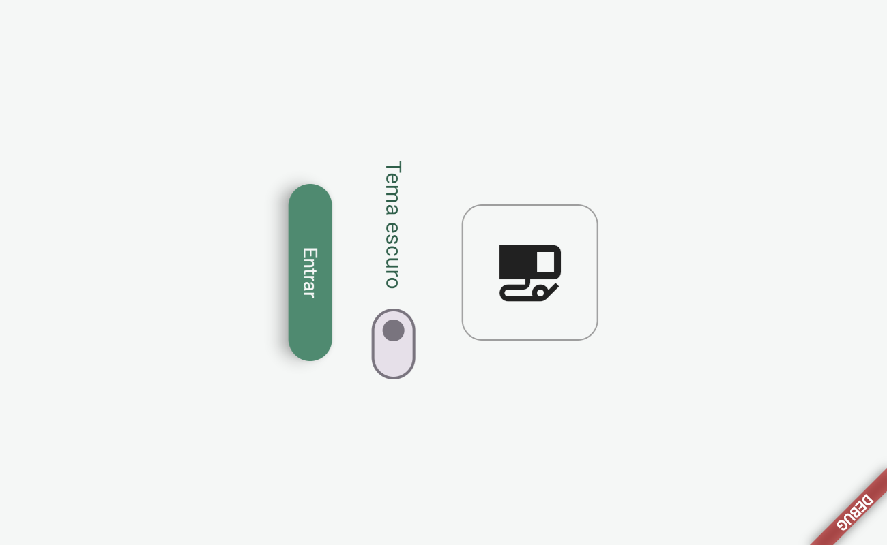
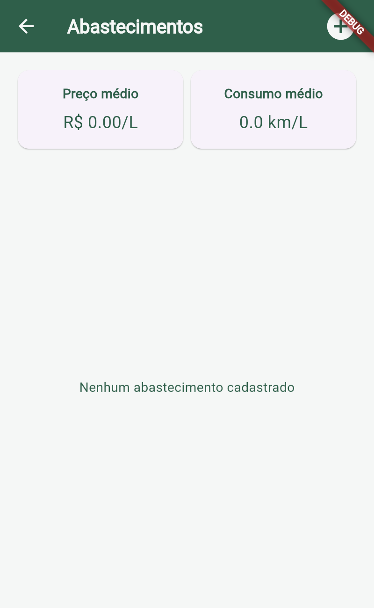
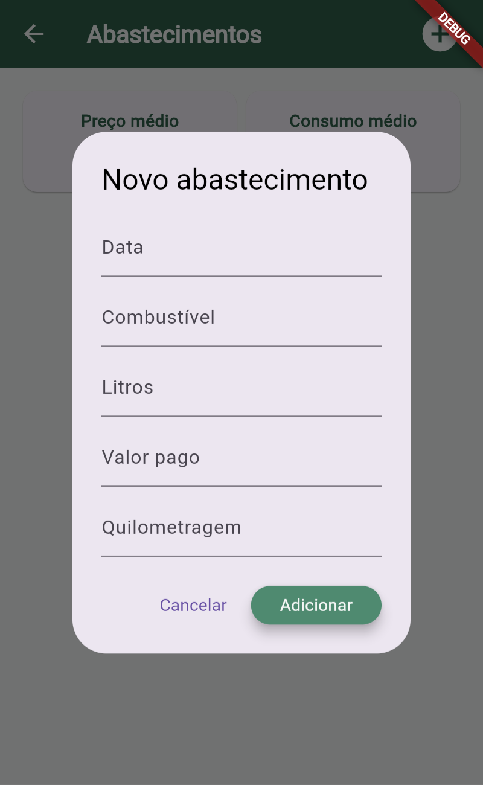
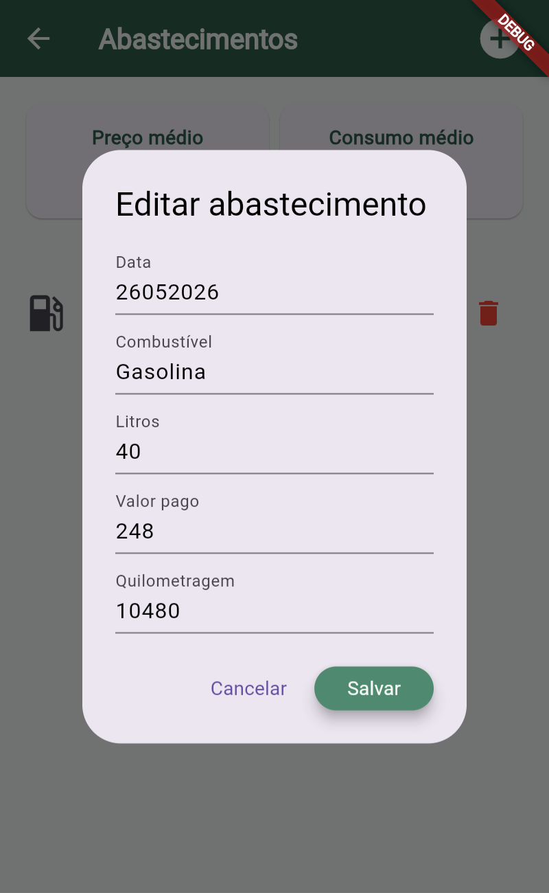

# Abastecimentos

Esse é um aplicativo feito em Flutter para registrar e acompanhar o histórico de abastecimentos de um veículo.

No app, é possível cadastrar a data, o tipo de combustível, a quantidade de litros, o valor pago e a quilometragem do veículo.

Com essas informações, o aplicativo calcula automaticamente o **preço médio por litro** e também o **consumo médio do veículo em km/L**, usando como base o abastecimento anterior.

## Tecnologias

* Flutter
* Dart
* SharedPreferences
* Material Design

## Funcionalidades

* Tela Splash
* Tema claro e escuro
* Cadastro de abastecimentos
* Lista com os abastecimentos cadastrados
* Exclusão de registros
* Edição de um abastecimento ao clicar no item
* Cálculo do preço médio por litro
* Cálculo do consumo médio do veículo
* Armazenamento local dos registros

## Como funcionam os cálculos

### Preço por litro

O preço por litro é calculado assim:

```text
Valor pago ÷ quantidade de litros
```

Exemplo:

```text
R$ 240 ÷ 40 litros = R$ 6,00/L
```

### Consumo médio

Para calcular o consumo, é usada a diferença entre a quilometragem atual e a quilometragem do abastecimento anterior:

```text
Quilometragem atual - quilometragem anterior
```

Depois, o resultado é dividido pela quantidade de litros abastecidos:

```text
Distância percorrida ÷ litros = km/L
```

## Passos para testar

1. Abra o projeto no Visual Studio Code.

2. Abra o terminal dentro da pasta do projeto.

3. Instale as dependências:

```bash
flutter pub get
```

4. Rode o aplicativo no Chrome usando uma porta fixa:

```bash
flutter run -d chrome --web-port 8080
```

A porta fixa ajuda a manter os dados salvos no navegador durante os testes.

5. Na tela inicial:

   * Teste o botão de tema escuro.
   * Clique em **Entrar**.

6. Na tela principal, clique no botão `+`.

7. Cadastre o primeiro abastecimento.

8. Clique em **Adicionar**.

9. Cadastre um segundo abastecimento.

10. Confira se o aplicativo mostra o consumo correto.

11. Confira também o preço médio por litro.

12. Clique em um abastecimento da lista para testar a edição.

13. Altere alguma informação e clique em **Salvar**.

14. Clique no ícone da lixeira para testar a exclusão de um registro.

15. Para testar o armazenamento local, deixe alguns abastecimentos cadastrados.

16. No terminal onde o Flutter está rodando, pressione:

```text
q
```

e depois `Enter`.

17. Rode o aplicativo novamente usando a mesma porta:

```bash
flutter run -d chrome --web-port 8080
```

18. Clique em **Entrar**.

Se os abastecimentos cadastrados anteriormente continuarem aparecendo, o armazenamento local está funcionando.

## Prints das telas

### Tela inicial



### Tela principal



### Cadastro de abastecimento



### Edição de abastecimento



## APK

O arquivo `.apk` do aplicativo está disponível na pasta `/assets`.

```text
assets/app-release.apk
```

2. Encaminha ele atraves de algum aplicativo e instala no seu celular.